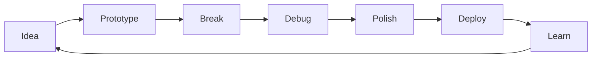

<div align="center">
 
  

  <br/>  
  
  

  <br/><br/>

  <a href="https://linkedin.com/in/krishna-ruhela-46a73a338">
    
  </a>
  

</div>

---

## ⚡ Developer Signal

```txt
kzsensi@github:~$ whoami

Name        : Krishna Ruhela
Role        : Full-stack Developer
Speciality  : Web apps, API integrations, dashboards, clean UI systems
Current Mode: Building, debugging, polishing, shipping
Mindset     : Make it useful. Make it fast. Make it beautiful.
```

I build software that turns messy workflows into clean, usable products.  
I like the space where **frontend polish**, **backend logic**, and **real-world API integrations** meet.

---

## 🧭 Mission Control

<table>
<tr>
<td width="50%">

### 🚀 I Build

- Full-stack web applications
- Dashboards and admin panels
- API integrations
- Automation tools
- Clean landing pages
- Scalable backend flows

</td>
<td width="50%">

### 🧠 I Think Like

- First make it work
- Then make it stable
- Then make it clean
- Then make it feel premium
- Then ship it

</td>
</tr>
</table>

---

## 🛠 Tech Constellation

<div align="center">


</div>

---

## 🧪 Current Build Profile

```yaml
developer:
  name: Krishna Ruhela
  username: kzsensi
  focus:
    - Full-stack product building
    - API integration and backend flows
    - Clean UI and frontend polish
    - Fast deployment and real-world debugging
  favorite_stack:
    frontend: [React, Next.js, TypeScript, Tailwind CSS]
    backend: [Node.js, NestJS, Python]
    database: [MySQL, Firebase, Supabase]
    deploy: [Vercel, Netlify, Google Cloud, Docker]
  status: "Always compiling something new"
```

---

## 📊 GitHub Radar

<div align="center">

  

</div>


## 🐍 Contribution Snake

<div align="center">

  <picture>
    <source media="(prefers-color-scheme: dark)" srcset="https://raw.githubusercontent.com/kzsensi/kzsensi/output/github-contribution-grid-snake-dark.svg" />
    <source media="(prefers-color-scheme: light)" srcset="https://raw.githubusercontent.com/kzsensi/kzsensi/output/github-contribution-grid-snake.svg" />
    
  </picture>

</div>

---

## 🧬 Build Philosophy

<table>
<tr>
<td align="center" width="33%">

### ⚡ Fast
Performance is not decoration.  
It is respect for the user.

</td>
<td align="center" width="33%">

### 🎨 Clean
Good UI should feel obvious  
before it feels impressive.

</td>
<td align="center" width="33%">

### 🧠 Useful
The best code quietly removes  
someone’s headache.

</td>
</tr>
</table>

---

## 🎮 Side Quests



- 🧰 Building tools that reduce manual work
- 🔌 Connecting APIs into real products
- 🎨 Designing UI that feels premium
- 🚢 Learning by shipping
- 🧪 Experimenting with automation and cloud workflows

---

## 🌐 Connect

<div align="center">

<a href="https://linkedin.com/in/krishna-ruhela-46a73a338">
  
</a>

<br/><br/>


</div>

---

<div align="center">

### `Thanks for visiting. Now go build something dangerously good.`

</div>
